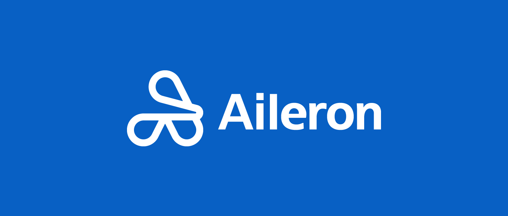

<p align="center">
  
</p>

<p align="center">
  Providing standards and tools for building<br />
  accessible, performant, and consistent user interfaces.
</p>

[](http://commitizen.github.io/cz-cli/) [](https://nx.dev) [](https://typescriptlang.org) [](https://lit.dev) [](https://github.com/prettier/prettier)


## How do we do that?

Welcome to Aileron! Our focus is to build a design system that enables American Airlines to deliver consistent, accessible, and delightful experiences for our customers. We achieve this by providing a cohesive set of components, tools, and resources that streamline the design and development process.

Here's how we do it:

* **Unified Design Language:** Aileron establishes a shared design language that promotes consistency across our web and mobile applications. By following this design language, our products provide a familiar and intuitive experience for our customers.

* **Reusable Components:** Our design system offers a comprehensive library of reusable, customizable components. These components are built with atomic design principles, which means they can be combined and extended to create a wide variety of user interface elements.

* **Adaptive and Accessible:** Aileron ensures that our components are responsive and work seamlessly across various screen sizes and devices. Additionally, we prioritize accessibility, making our products usable and enjoyable for all users, including those with disabilities.

* **Design and Development Collaboration:** Aileron bridges the gap between designers and developers by providing design resources, guidelines, and code snippets that can be easily integrated into projects. This fosters better communication and collaboration, leading to more efficient and effective product development.

* **Continuous Improvement:** We actively seek feedback from our users and the American Airlines community to iterate and improve upon Aileron. By staying in tune with the needs of our users, we can refine our design system to better serve our customers and meet the evolving demands of the digital landscape.

By leveraging these principles, Aileron empowers the American Airlines team to build outstanding digital products that deliver exceptional user experiences.


## How do I get started?

Aileron is a collection of atomically designed components and tools that can be used to build American Airlines' website and applications. Aileron is built using [Tailwind CSS](https://tailwindcss.com/), a utility-first CSS framework. These packages can be used together or separately depending on the needs of your project.

All packages can be installed via [Node Package Manager](https://www.npmjs.com/) (npm) using our [Package Registry](https://packages.aa.com/ui/packages). Run the following command(s) to install the packages you need.
  ```sh
npm install @aileron/accordion --save
npm install @aileron/button --save
npm install @aileron/button-icon --save
npm install @aileron/card --save
npm install @aileron/carousel --save
npm install @aileron/checkbox --save
npm install @aileron/content-switcher --save
npm install @aileron/data-table --save
npm install @aileron/dialog --save
npm install @aileron/divider --save
npm install @aileron/grid --save
npm install @aileron/icon --save
npm install @aileron/link --save
npm install @aileron/list --save
npm install @aileron/loading --save
npm install @aileron/notification --save
npm install @aileron/overflow --save
npm install @aileron/radio-button --save
npm install @aileron/select --save
npm install @aileron/tabs --save
npm install @aileron/tag --save
npm install @aileron/tailwind --save
npm install @aileron/text-input --save
npm install @aileron/tile --save
npm install @aileron/toast --save
npm install @aileron/tooltip --save
```

## Thank you to our contributors ✨

<!-- ALL-CONTRIBUTORS-LIST:START - Do not remove or modify this section -->
<!-- prettier-ignore-start -->
<!-- markdownlint-disable -->
<table>
  <tbody>
    <tr>
      <td align="center" valign="top" width="14.28%"><a href="https://github.com/ozee"><br /><sub><b>David Ozee</b></sub></a><br /><a href="Maintainer" title="">Maintainer</a></td>
      <td align="center" valign="top" width="14.28%"><a href="https://github.com/michaelnguyenaa"><br /><sub><b>Michael Nguyen</b></sub></a><br /><a href="#projectManager-michaelnguyenaa" title="">Project Manager</a></td>
      <td align="center" valign="top" width="14.28%"><a href="https://github.com/stompkeAA"><br /><sub><b>Shawn Tompke</b></sub></a><br /><a href="Developer" title="">Developer</a></td>
      <td align="center" valign="top" width="14.28%"><a href="https://github.com/JoseAndresNC"><br /><sub><b>JoseAndresNC</b></sub></a><br /><a href="Developer" title="">Developer</a></td>
      <td align="center" valign="top" width="14.28%"><a href="https://github.com/NathanProffitt"><br /><sub><b>NathanProffitt</b></sub></a><br /><a href="Designer" title="">Designer</a></td>
      <td align="center" valign="top" width="14.28%"><a href="https://github.com/Dixit2207"><br /><sub><b>Pranshu Dixit</b></sub></a><br /><a href="Contributor" title="">Contributor</a></td>
      <td align="center" valign="top" width="14.28%"><a href="https://github.com/WigginsDamien"><br /><sub><b>WigginsDamien</b></sub></a><br /><a href="Contributor" title="">Contributor</a></td>
    </tr>
    <tr>
      <td align="center" valign="top" width="14.28%"><a href="https://github.com/Christian77777"><br /><sub><b>Christian Devile</b></sub></a><br /><a href="Contributor" title="">Contributor</a></td>
      <td align="center" valign="top" width="14.28%"><a href="https://github.com/myamericanairlines"><br /><sub><b>Eric McMillan</b></sub></a><br /><a href="Contributor" title="">Contributor</a></td>
      <td align="center" valign="top" width="14.28%"><a href="https://github.com/JohnPalasota"><br /><sub><b>John Palasota</b></sub></a><br /><a href="Contributor" title="">Contributor</a></td>
      <td align="center" valign="top" width="14.28%"><a href="https://github.com/Sairamgoudvangala"><br /><sub><b>sairam vangala</b></sub></a><br /><a href="Contributor" title="">Contributor</a></td>
      <td align="center" valign="top" width="14.28%"><a href="https://github.com/Daniel5170"><br /><sub><b>Yifan Daniel,Yang</b></sub></a><br /><a href="Contributor" title="">Contributor</a></td>
      <td align="center" valign="top" width="14.28%"><a href="https://github.com/jamesmaddoxaa"><br /><sub><b>jamesmaddoxaa</b></sub></a><br /><a href="Contributor" title="">Contributor</a></td>
      <td align="center" valign="top" width="14.28%"><a href="https://github.com/RafaelEspino"><br /><sub><b>RafaelEspino</b></sub></a><br /><a href="Contributor" title="">Contributor</a></td>
    </tr>
  </tbody>
</table>

<!-- markdownlint-restore -->
<!-- prettier-ignore-end -->

<!-- ALL-CONTRIBUTORS-LIST:END -->
# shawns-component-library
